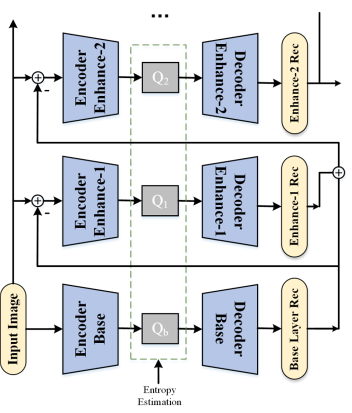
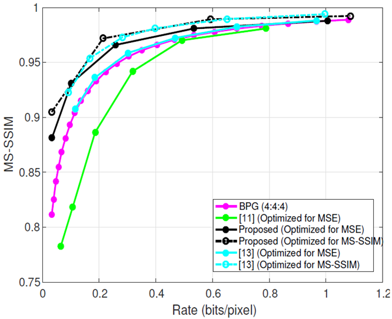
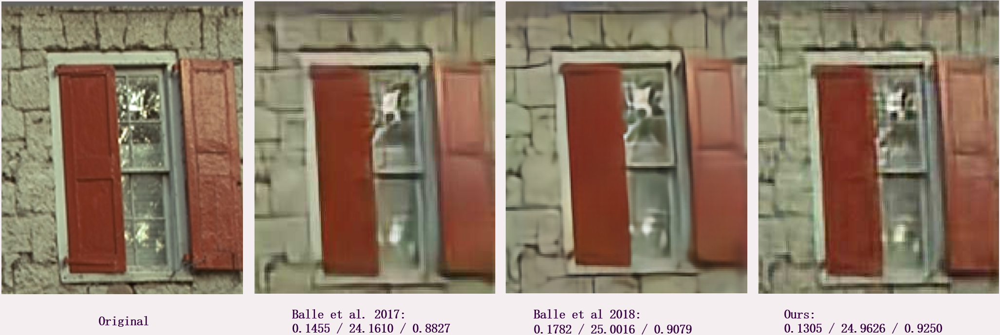
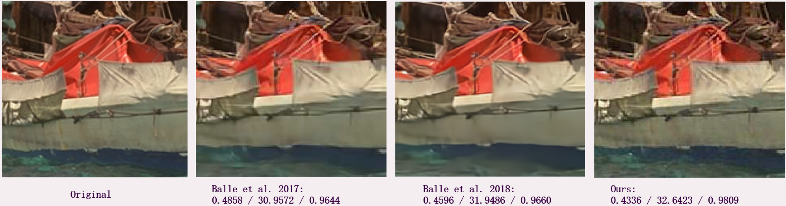

## Scalable Auto-Enoder for Layered Image Compression

### [[Paper]](https://ieeexplore.ieee.org/abstract/document/8695403/) [[Citation]](#citation)

TensorFlow implementation of **Layered Image Compression using Scalable Auto-encoder**, published in IEEE-MIPR 2019.
The overall structure is a present a generic scalable model by stacking various auto-encoders such that variable bit-rate points could be realized.

---

### Prerequisites

- [Download CLIC2018 Dataset for Training](http://www.compression.cc/2018/challenge/) and extract them to
`corpus/clic2018`
- Python 3 (tested with Python 3.5)
- Tensorflow (tested with tensorflow-gpu 1.4.1)
- [Tensorflow-compression module](https://tensorflow.github.io/compression/)
- Python packages as specified by requirements.txt (`pip install -r requirements.txt`)
- A CUDA-compatible GPU

---

### Train

To conduct training of the scalable auto-encoder (SAE), please make sure the training set is prepared. You may also adjust the hyper-parameters in the training files. Then use the following command

    python train_base.py

to train the base layer of the SAE. Similarly, the consequent training for enhance layers (ELs) can be achieved by

    python train_el*.py

where `train_el*` denotes the EL number, which should be replaced by

- `train_el1`: base layer plus one enhance layer
- `train_el2`: base layer plus two enhance layers
- `train_el3`: base layer plus three enhance layers

NOTE: we should emphasize that since the proposed architecture is a scalable cascaded structure, to obtain the highest bit-rate point, all layers including base and Els are needed to be trained with the order of base, EL1, El2, EL3, etc.

### Inference

After trained the models, please prepared the Kodak datset for testing and place them it folder `kodak/`.

---

To do inference, use the following command

    python test_base.py 

similar to training, for the ELs, the inference should be,

    python test_el*.py

where `test_el*` denotes the EL number, which should be replaced by

- `test_el1`: base layer plus one enhance layer
- `test_el2`: base layer plus two enhance layers
- `test_el3`: base layer plus three enhance layers

Note that after training, the checkpointer for each layer will store the trained networks, the parameters for each EL are saved separately.
The rate-distorion curves over all images in Kodak dataset are shown below:

---

### 4. Visual Comparisons

Two simple examples for visual comparisons of restored images are provided (bpp/PSNR/MS-SSIM).

 

For more details of the reconstructed images and their corresponding bit-rate, please refer to the following GitHub repo:

[[Supplymentary Material MIPR2019]](https://github.com/chuanminj/MIPR2019)

which contains each reconstructed image of Kodak dataset under multiple bit-rate points.

---

### Citation

If you find this repo is useful for your research, please cite this paper:

    @inproceedings{jia2019layered,
	    title={Layered Image Compression using Scalable Auto-encoder},
	    author={Jia, Chuanmin and Liu, Zhaoyi and Wang, Yao and Ma, Siwei and Gao, Wen},
	    booktitle={IEEE Conference on Multimedia Information Processing and Retrieval (MIPR)},
	    pages={431--436},
	    year={2019},
	    organization={IEEE}
	}
